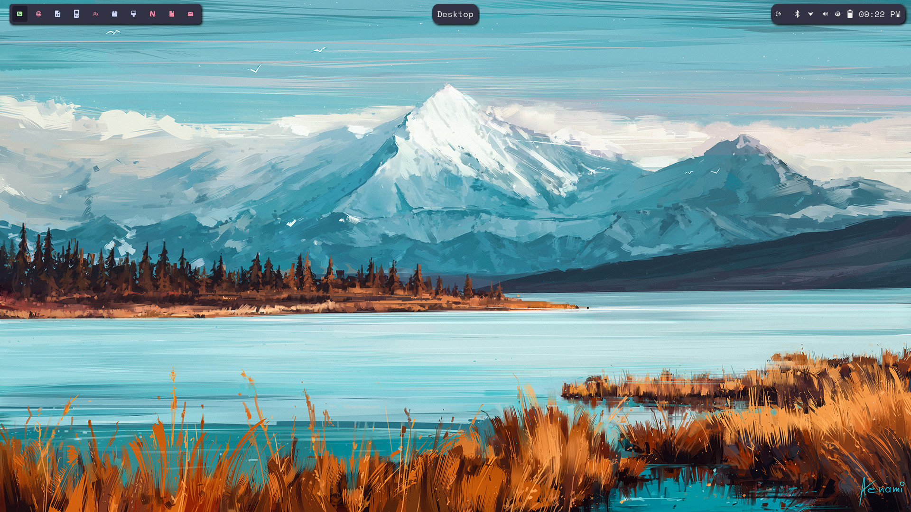

# Customizing Waybar CSS on Omarchy

I have been loving running OmarchyOS. It's a fantastic system for power-users such as myself. I must say though...I wasn't a huge fan of the default Waybar styling that ships with the OS. I had to change that 🤔 

I came up with a floating style modular Waybar config that I am quite fond of - only issue is that the bar was using hard-coded colors because the Omarchy Waybar CSS only exposes two CSS variables by default - foreground and background. No good. 

Just today, however, I found a file located in `~/.config/omarchy/hooks` called theme-set.sample. Interesting 🤔 We can work with this.

This file works by passing the switched-to theme as an argument via bash. Ready to theme your Waybar like never before? Let's cook 🧑‍🍳

## Step 1

Start by renaming the file to theme-set (removing the .sample portion from the filename.) and make it executable. Simply run this command:

```bash
mv ~/.config/omarchy/hooks/theme-set.sample ~/.config/omarchy/hooks/theme-set && chmod +x ~/.config/omarchy/hooks/theme-set
```

## Step 2

Now let's add some functionality to this file. Slap the following code in it to make it react to both of the built-in [Catppuccin themes](https://catppuccin.com). This will make your Waybar react to both the light and dark versions of this amazing theme.

```bash
#!/bin/bash
# ~/.config/omarchy/hooks/theme-set

THEME_NAME=$1
COLOR_FILE="$HOME/.config/waybar/theme-colors.css"

case $THEME_NAME in
"catppuccin" | "catppuccin-mocha")
  # Catppuccin Mocha (Dark)
  rosewater="#f5e0dc"
  flamingo="#f2cdcd"
  pink="#f5c2e7"
  mauve="#cba6f7"
  red="#f38ba8"
  maroon="#eba0ac"
  peach="#fab387"
  yellow="#f9e2af"
  green="#a6e3a1"
  teal="#94e2d5"
  sky="#89dceb"
  sapphire="#74c7ec"
  blue="#89b4fa"
  lavender="#b4befe"
  text="#cdd6f4"
  subtext1="#bac2de"
  subtext0="#a6adc8"
  overlay2="#9399b2"
  overlay1="#7f849c"
  overlay0="#6c7086"
  surface2="#585b70"
  surface1="#45475a"
  surface0="#313244"
  base="#1e1e2e"
  mantle="#181825"
  crust="#11111b"
  ;;
"catppuccin-latte")
  # Catppuccin Latte (Light)
  rosewater="#dc8a78"
  flamingo="#dd7878"
  pink="#ea76cb"
  mauve="#8839ef"
  red="#d20f39"
  maroon="#e64553"
  peach="#fe640b"
  yellow="#df8e1d"
  green="#40a02b"
  teal="#179287"
  sky="#04a5e5"
  sapphire="#209fb5"
  blue="#1e66f5"
  lavender="#7287fd"
  text="#4c4f69"
  subtext1="#5c5f77"
  subtext0="#6c6f85"
  overlay2="#7c7f93"
  overlay1="#8c8fa1"
  overlay0="#9ca0b0"
  surface2="#acb0be"
  surface1="#bcc0cc"
  surface0="#ccd0da"
  base="#eff1f5"
  mantle="#e6e9ef"
  crust="#dce0e8"
  ;;
*)
  # Default fallback to Mocha if theme is unknown
  rosewater="#f5e0dc"
  flamingo="#f2cdcd"
  pink="#f5c2e7"
  mauve="#cba6f7"
  red="#f38ba8"
  maroon="#eba0ac"
  peach="#fab387"
  yellow="#f9e2af"
  green="#a6e3a1"
  teal="#94e2d5"
  sky="#89dceb"
  sapphire="#74c7ec"
  blue="#89b4fa"
  lavender="#b4befe"
  text="#cdd6f4"
  subtext1="#bac2de"
  subtext0="#a6adc8"
  overlay2="#9399b2"
  overlay1="#7f849c"
  overlay0="#6c7086"
  surface2="#585b70"
  surface1="#45475a"
  surface0="#313244"
  base="#1e1e2e"
  mantle="#181825"
  crust="#11111b"
  ;;
esac

# Write all tokens to the CSS file
cat <<EOF >"$COLOR_FILE"
@define-color rosewater $rosewater;
@define-color flamingo $flamingo;
@define-color pink $pink;
@define-color mauve $mauve;
@define-color red $red;
@define-color maroon $maroon;
@define-color peach $peach;
@define-color yellow $yellow;
@define-color green $green;
@define-color teal $teal;
@define-color sky $sky;
@define-color sapphire $sapphire;
@define-color blue $blue;
@define-color lavender $lavender;
@define-color text $text;
@define-color subtext1 $subtext1;
@define-color subtext0 $subtext0;
@define-color overlay2 $overlay2;
@define-color overlay1 $overlay1;
@define-color overlay0 $overlay0;
@define-color surface2 $surface2;
@define-color surface1 $surface1;
@define-color surface0 $surface0;
@define-color base $base;
@define-color mantle $mantle;
@define-color crust $crust;
EOF

# Signal Waybar to reload
# doesn't seem like we actually need this.
# killall -SIGUSR2 waybar
```

We're well on our way to dynamic Waybar theming! Just one more thing to do: import our newly generated CSS file and apply the colors in our Waybar styling!

## Step 3


> [!NOTE] Careful!
> Be sure you switch your theme first before trying to use the CSS variables in it! You must switch your theme to activate the theme-hook we just wrote!


Find your Waybar CSS file at `~/.config/waybar/style.css` and open it up. Now import the newly generated file with `@import "theme-colors.css";` as the hook file generates it in our Waybar config folder. Access the variables using the `@` syntax, e.x. `background: @surface0;` or `color: @sky`.

That's pretty much it! Once you swap all your hardcoded colors for CSS variables and switch themes you'll see your Waybar change to match! 

Pretty damn cool, man! 🎉

## Extras

For brevity, here is my complete Waybar style.css:

```css
@import "../omarchy/current/theme/waybar.css";
@import "theme-colors.css";

* {
  border: none;
  font-family: "SpaceMono Nerd Font Mono";
  font-size: 18px;
  padding: 0px;
  margin: 0px;
}

.modules-left {
  margin-left: 12px;
}

.modules-right {
  background: @surface0;
  padding: 2px 10px;
  margin: 8px 3px;
  border-radius: 14px;
  box-shadow: 2px 3px 3px black;
  margin-right: 12px;
}

.modules-center {
  background: none;
  box-shadow: 0 0 0 transparent;
}

#workspaces {
  margin: 8px 8px;
  padding: 0px 2px;
  background: @surface0;
  border-radius: 6px;
  font-size: 18px;
  box-shadow: 2px 3px 3px black;
  /* border: 1px solid @teal; */
}

window#waybar {
  background: none;
}

window#waybar #window {
  background: @surface0;
  padding: 2px 10px;
  margin: 8px 3px;
  border-radius: 14px;
  box-shadow: 2px 3px 3px black;
}

/* Hide the window title when no windows are open */
window#waybar.empty #window {
  background: @surface0;
  padding: 2px 10px;
  margin: 8px 3px;
  border-radius: 14px;
  box-shadow: 2px 3px 3px black;
}

#workspaces button.empty {
  color: @text;
}

/* workspaces with windows in them */
#workspaces button {
  color: @red;
  border: none;
  background: none;
  padding: 3px 8px;
  border-radius: 4px;
  margin: 4px;
  transition: all 0.3s ease-in-out;
}

#workspaces button.visible {
  background: transparent;
  color: @green;
}
#workspaces button.urgent {
  background: @base;
  color: @red;
  text-decoration: underline;
}

/* #workspaces button.persistent { */
/*   color: @yellow; */
/* } */

#workspaces button.active {
  background: @base;
  color: @green;
}

#workspaces button:hover {
  color: @green;
  background: @crust;
}

#cpu,
#battery,
#pulseaudio,
#custom-omarchy,
#custom-screenrecording-indicator,
#custom-update {
  min-width: 12px;
  margin: 0 7.5px;
}

#tray {
  margin-right: 16px;
}

#bluetooth {
  margin-right: 17px;
}

#network {
  margin-right: 13px;
}

#custom-expand-icon {
  margin-right: 18px;
}

tooltip {
  padding: 2px;
}

#custom-update {
  font-size: 10px;
}

#clock {
  margin-left: 5px;
}

.hidden {
  opacity: 0;
}

#custom-screenrecording-indicator {
  min-width: 12px;
  margin-left: 5px;
  font-size: 10px;
  padding-bottom: 1px;
}

#custom-screenrecording-indicator.active {
  color: @red;
}

#custom-voxtype {
  min-width: 12px;
  margin: 0 0 0 7.5px;
}

#custom-voxtype.recording {
  color: @red;
}

```

As well as my entire Waybar config (located at `~/.config/waybar/config.jsonc):

```json
{
  "reload_style_on_change": true,
  "layer": "top",
  "position": "top",
  "spacing": 0,
  "height": 32,
  "modules-left": ["hyprland/workspaces"],
  "modules-center": [
    "hyprland/window",
    "custom/update",
    "custom/screenrecording-indicator",
  ],
  "modules-right": [
    "group/tray-expander",
    "bluetooth",
    "network",
    "pulseaudio",
    "cpu",
    "battery",
    "clock",
  ],
  "hyprland/workspaces": {
    "on-click": "activate",
    "format": "{icon}",
    "format-icons": {
      "1": "",
      "2": "󰖟",
      "3": "󰈮",
      "4": "󱎓",
      "5": "",
      "6": "",
      "7": "󱠓",
      "8": "",
      "9": "󰠮",
      "10": "󰇮",
      "11": "",
      "12": "",
    },
    "persistent-workspaces": {
      "1": [],
      "2": [],
      "3": [],
      "4": [],
      "5": [],
      "6": [],
      "7": [],
      "8": [],
      "9": [],
    },
  },
  "custom/omarchy": {
    "format": "<span font='omarchy'>\ue900</span>",
    "on-click": "omarchy-menu",
    "on-click-right": "xdg-terminal-exec",
    "tooltip-format": "Omarchy Menu\n\nSuper + Alt + Space",
  },
  "hyprland/window": {
    "format": "{title}",
    "icon": true,
    "icon-size": 18,
    "rewrite": {
      "": "Desktop",
      "nvim": "  NeoCode $1",
    },
  },
  "custom/update": {
    "format": "",
    "exec": "omarchy-update-available",
    "on-click": "omarchy-launch-floating-terminal-with-presentation omarchy-update",
    "tooltip-format": "Omarchy update available",
    "signal": 7,
    "interval": 3600,
  },

  "cpu": {
    "interval": 5,
    "format": "󰍛",
    "on-click": "omarchy-launch-or-focus-tui btop",
  },
  "clock": {
    "format": "{:%I:%M %p}",
    "format-alt": "{:%a, %b %d, %Y}",
    "tooltip-format": "<big>{:%A, %d %B %Y}</big>",
    "tooltip": true,
    "on-click-right": "omarchy-launch-floating-terminal-with-presentation omarchy-tz-select",
  },
  "network": {
    "format-icons": ["󰤯", "󰤟", "󰤢", "󰤥", "󰤨"],
    "format": "{icon}",
    "format-wifi": "{icon}",
    "format-ethernet": "󰀂",
    "format-disconnected": "󰤮",
    "tooltip-format-wifi": "{essid} ({frequency} GHz)\n⇣{bandwidthDownBytes}  ⇡{bandwidthUpBytes}",
    "tooltip-format-ethernet": "⇣{bandwidthDownBytes}  ⇡{bandwidthUpBytes}",
    "tooltip-format-disconnected": "Disconnected",
    "interval": 3,
    "spacing": 1,
    "on-click": "omarchy-launch-wifi",
  },
  "battery": {
    "format": "{capacity}% {icon}",
    "format-discharging": "{icon}",
    "format-charging": "{icon}",
    "format-plugged": "",
    "format-icons": {
      "charging": ["󰢜", "󰂆", "󰂇", "󰂈", "󰢝", "󰂉", "󰢞", "󰂊", "󰂋", "󰂅"],
      "default": ["󰁺", "󰁻", "󰁼", "󰁽", "󰁾", "󰁿", "󰂀", "󰂁", "󰂂", "󰁹"],
    },
    "format-full": "󰂅",
    "tooltip-format-discharging": "{power:>1.0f}W↓ {capacity}%",
    "tooltip-format-charging": "{power:>1.0f}W↑ {capacity}%",
    "interval": 5,
    "on-click": "omarchy-menu power",
    "states": {
      "warning": 20,
      "critical": 10,
    },
  },
  "bluetooth": {
    "format": "",
    "format-disabled": "󰂲",
    "format-off": "󰂲",
    "format-connected": "󰂱",
    "format-no-controller": "",
    "tooltip-format": "Devices connected: {num_connections}",
    "on-click": "omarchy-launch-bluetooth",
  },
  "pulseaudio": {
    "format": "{icon}",
    "on-click": "omarchy-launch-audio",
    "on-click-right": "pamixer -t",
    "tooltip-format": "Playing at {volume}%",
    "scroll-step": 5,
    "format-muted": "",
    "format-icons": {
      "headphone": "",
      "default": ["", "", ""],
    },
  },
  "group/tray-expander": {
    "orientation": "inherit",
    "drawer": {
      "transition-duration": 600,
      "children-class": "tray-group-item",
    },
    "modules": ["custom/expand-icon", "tray"],
  },
  "custom/expand-icon": {
    "format": " ",
    "tooltip": false,
  },
  "custom/screenrecording-indicator": {
    "on-click": "omarchy-cmd-screenrecord",
    "exec": "$OMARCHY_PATH/default/waybar/indicators/screen-recording.sh",
    "signal": 8,
    "return-type": "json",
  },
  "custom/voxtype": {
    "exec": "omarchy-voxtype-status",
    "return-type": "json",
    "format": "{icon}",
    "format-icons": {
      "idle": "",
      "recording": "󰍬",
      "transcribing": "󰔟",
    },
    "tooltip": true,
    "on-click-right": "omarchy-voxtype-config",
    "on-click": "omarchy-voxtype-model",
  },
  "tray": {
    "icon-size": 12,
    "spacing": 12,
  },
}
```

It makes a style like this:




I think it's pretty damn snazzy looking. Hope you enjoyed and learned something! 👏
