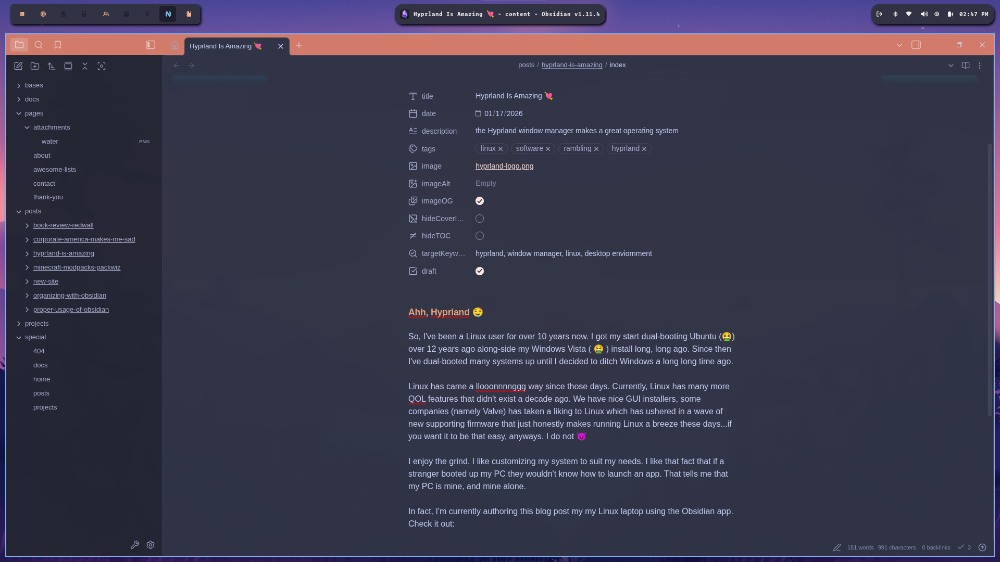
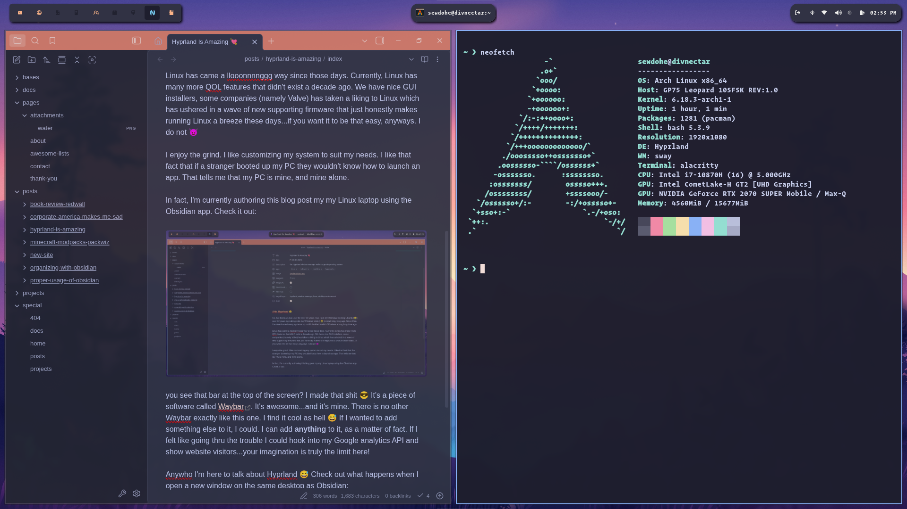

## Ahh, Hyprland 🤤

So, I've been a Linux user for over 10 years now. I got my start dual-booting Ubuntu (🤮) over 12 years ago along-side my Windows Vista ( 🤮 ) install long, long ago. Since then I've dual-booted many systems up until I decided to ditch Windows a long long time ago.

Linux has came a llooonnnnggg way since those days. Currently, Linux has many more QOL features that didn't exist a decade ago. We have nice GUI installers, some companies (namely Valve) has taken a liking to Linux which has ushered in a wave of new supporting firmware that just honestly makes running Linux a breeze these days...if you want it to be that easy, anyways. I do not 😈

I enjoy the grind. I like customizing my system to suit my needs. I like that fact that if a stranger booted up my PC they wouldn't know how to launch an app. That tells me that my PC is mine, and mine alone. 

In fact, I'm currently authoring this [blog post](posts/new-site/index.md) on my Linux laptop using the Obsidian app. 

Check it out: 



you see that bar at the top of the screen? I made that shit 😎 It's a piece of software called [Waybar](https://waybar.org). It's awesome...and it's mine. There is no other Waybar exactly like this one. I find it cool as hell 😅 If I wanted to add something else to it, I could. I can add **anything** to it, as a matter of fact. If I felt like going thru the trouble I could hook into my Google analytics API and show website visitors...your imagination is truly the limit here!

Anywho I'm here to talk about Hyprland 😅 Check out what happens when I open a new window on the same desktop as Obsidian:



See that shit? That's a *tiling window manager for you*. 😎

See the list of icons on the upper left of the desktop?


These are all of my "work-spaces". These allow me to run different apps on separate *virtual desktops*. This keeps a single workspace from becoming too cluttered.

It's in all honesty a godsend. I don't have to worry with a task-manager taking up tons of space for applications that I launch frequently. They are available as key-binds that I set in my config files. I can make certain windows launch on certain workspaces when I open them to keep things organized. I can switch easily between my different workspaces with a simple key-bind (`super/win + 1-9 keys`)

Sure - it's an entirely different paradigm to tradtitional window-management but I'm telling you: *once you get used to this everything else sucks donkey ass*

Configuration is also easy-as-pie. Take a at this minimal config that comes default from [Omarchy OS](https://omarchy.org):

```conf
# Learn how to configure Hyprland: https://wiki.hyprland.org/Configuring/

# Use defaults Omarchy defaults (but don't edit these directly!)
source = ~/.local/share/omarchy/default/hypr/autostart.conf
source = ~/.local/share/omarchy/default/hypr/bindings/media.conf
source = ~/.local/share/omarchy/default/hypr/bindings/clipboard.conf
source = ~/.local/share/omarchy/default/hypr/bindings/tiling-v2.conf
source = ~/.local/share/omarchy/default/hypr/bindings/utilities.conf
source = ~/.local/share/omarchy/default/hypr/envs.conf
source = ~/.local/share/omarchy/default/hypr/looknfeel.conf
source = ~/.local/share/omarchy/default/hypr/input.conf
source = ~/.local/share/omarchy/default/hypr/windows.conf
source = ~/.config/omarchy/current/theme/hyprland.conf

# Change your own setup in these files (and overwrite any settings from defaults!)
source = ~/.config/hypr/monitors.conf
source = ~/.config/hypr/input.conf
source = ~/.config/hypr/bindings.conf
source = ~/.config/hypr/looknfeel.conf
source = ~/.config/hypr/autostart.conf

# Add any other personal Hyprland configuration below
# windowrule = workspace 5, match:class qemu
windowrule = workspace 5, match:class vesktop
windowrule = workspace 2, match:class vivaldi
windowrule = workspace 8, match:class nvim
windowrule = workspace 9, match:class obsidian

# Apply the bibata cursor theme
env = HYPRCURSOR_THEME,Bibata-Original-Ice
env = HYPRCURSOR_SIZE,24

```

It's all pretty intuitive. Speaking of Omarchy OS - that is the current system I'm using. Omarchy OS is an opinionated OS with super sane defaults out-of-the-box and uses Hyprland as it's default window-manager. *I cannot recommend it enough!* I probably wouldn't switch to Omarchy as a new Linux user, however, as it could easily get frustrating if you're not used to how Linux works.