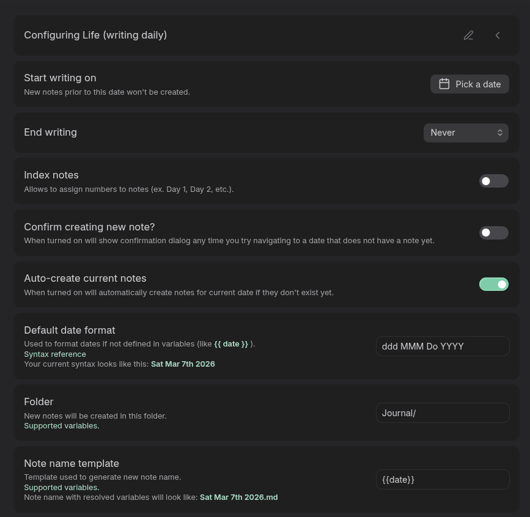
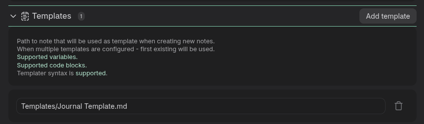
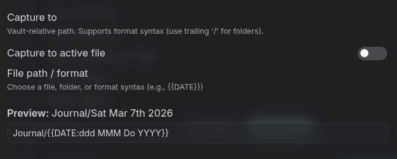
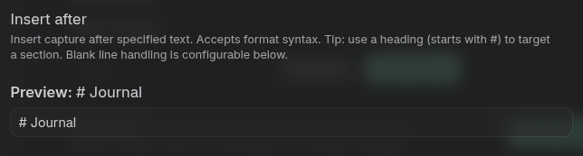
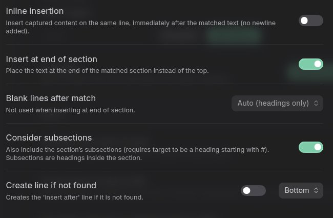
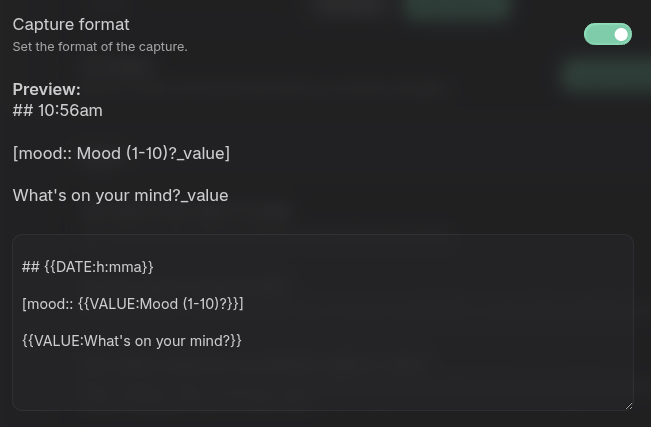
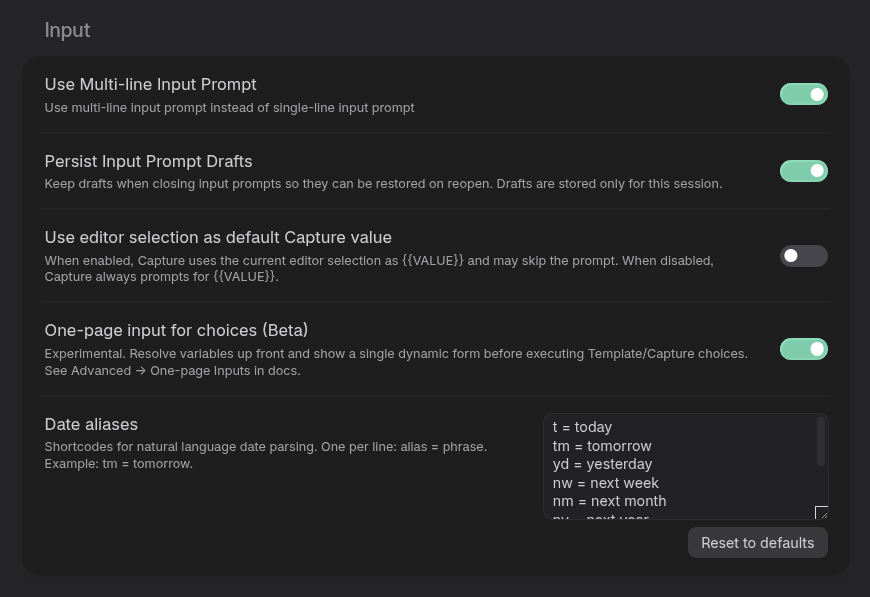
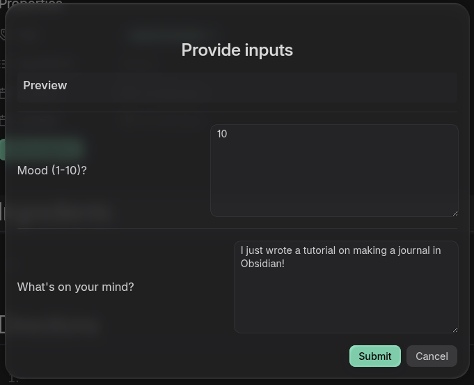
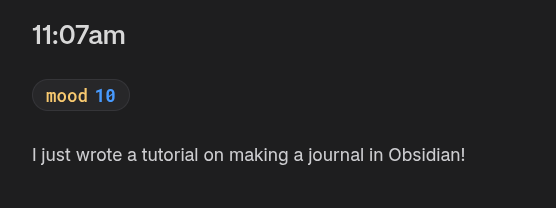
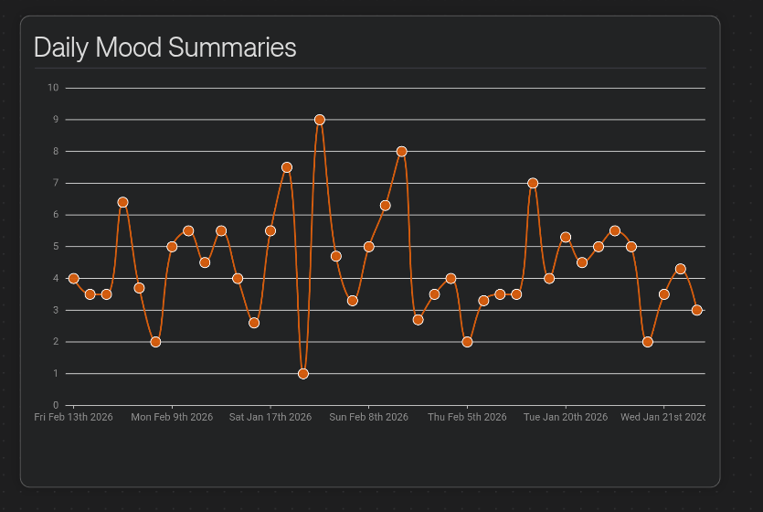

# Journaling With Obsidian

I absolutely love Obsidian. It's become more than a second brain to me - I use it for keeping track of tasks, bills, notes on projects, and so much more. One of the most useful things I've found that Obsidian is good for however, is *journaling.* It's become a fantastic and healthy hobby for me. 

It's not completely intuitive, though. Efficient journaling *for me* has been a couple months-long struggle to optimize a system for it. 

In this post I am going to try and run you through how I've created an effective journaling system  that allows you to:

- keep daily notes for each day
- easily notate your moods throughout the day
- view statistics about your moods through rendering mood-data in charts!
- keep track of hobbies/anything you find important in your life

I've found that tracking these things can give you insight into what kind of things in life make you happy or depressed. I've found it very insightful, at least. 

Ready to get started? 💪

## Before you start: Requirements

You'll need a few plugins to make this workflow:

- [Dataview](https://github.com/blacksmithgu/obsidian-dataview)
- [Journal](https://github.com/srg-kostyrko/obsidian-journal)
- [QuickAdd](https://github.com/chhoumann/quickadd)
- [ChartsView](https://github.com/caronchen/obsidian-chartsview-plugin)

Dataview to aggregate data on your moods, chartsview to display mood data, quickadd for quick journal entries, and of course journal to manage your daily notes.

Add those to Obsidian and let's get started!

## The Meat: Journal Plugin

The foundation for this system is the [Journal Plugin](https://github.com/srg-kostyrko/obsidian-journal). This plugin allows easy creation of daily notes, as well as providing a very nice and elegant looking navigation at the top of said notes: 
*insert image here*
The plugin is capable of much more than just daily notes, however that's all that I use it for in my system.

The way we set it up is like so:

1. create a new journal. I simply called mine journal...it's the only one we're going to create. 
2. Set it to happen daily
3. enable opening the note at startup; it will be the "home base" of your vault, essentially. 
4. Set the notes to be made in a top-level folder in your vault called Journal. You may have to manually create this folder.



Now. we need a template for these daily journal notes. Make a folder in your vault called `Templates` (if you don't already have one!) and make a note in it called `Journal Template`. At the minimum, add a top-level heading to it called Journal:

```markdown

(...anything else you want in the daily template!)

# Journal


```


Then add it to your daily journal settings template section:



## Easily Add Entries - QuickAdd Plugin

For me, this plugin is what made Journaling feel **intuitive**. Before this, it was a pain to enter my Journal note, add a heading, add mood data, and enter some text throughout the day. This plugin allows us to use one command, enter a number for our mood (1-10) and put an entry into the journal all in one fell swoop! 

Let's configure it!

Start by adding the QuickAdd plugin from the community plugins tab, and open it's configuration. You'll see a text box twards the bottom of the first section, followed by a drop-down that says template. Enter `Journal Entry` into the text box, click the drop-down that says template, and select `macro`. Hit create, then click the cog icon next to the new QuickAdd we just made.

Now; there is quite a bit of config to do here!

In the top section, fill it out like so:



> [!WARNING]
> I'd recommend sticking to the same date format I've used here as it's easy to read and will make following the rest of this tutorial easier. Otherwise you'll need to edit the chartsview query later in the post to match!

Fill out the insert after section like so:



Ensure insert at end of section and consider sub-sections is ticked as well:



Lastly, fill out the capture format as follows:



> [!tip]
> If using 24hr time replace h with H in the {DATE:} format

Now, in your QuickAdd general settings, set these settings for the input prompt:




This allows the input modal to be multi-lined for writing longer journal entries!

Alright! Now you've gotten yourself a Journal setup with Obsidian! 

Give it a test! If your daily note isn't already open, open it by using the command pallete (crtl +p) and open today's note - then use the command pallete again and choose "Journal Entry". A dialog should pop up - rate your current mood and write a little about what's on your mind and submit it - and you'll see it populate automatically in your daily journal note!






Now; let's take a closer look at what we just made. 

You see the pill that says mood: 10? That's a **dataview inline property.** Yours may look different from mine, I've styled my pills with custom css. If you'd like to have these styled as well, create a new css file in your vaults `.obsidian/snippets/` folder (it's a hidden folder so make sure your file explorer is set to show hidden files) and add this content to it:

```css
/* Style all inline dataview fields */
.dataview.inline-field {
    background-color: var(--background-secondary);
    padding: 4px 12px;
    border-radius: 999px;
    border: 1px solid var(--background-modifier-border);
}

/* Remove inner backgrounds */
.dataview.inline-field-key,
.dataview.inline-field-value {
    background: none !important;
    padding: 0;
}

/* Style the key */
.dataview.inline-field-key {
    color: var(--color-yellow);
    margin-right: 6px;
    font-weight: 500;
}

/* Style the value */
.dataview.inline-field-value {
    font-weight: bold;
    color: var(--color-blue);
}
```

Then visit your appearance settings, scroll to the bottom, and enable the snippet you just created. It will be the same name as the file you made in `/snippets`

## Viewing your data: ChartsView

So, now that we have a way to:

- Have automatic daily notes
- Place entries into said daily notes with ease
- Have *data* in these daily entries

Now we need a way to aggregate and view all of this new juicy data! We're going to be using charts - because...charts good.

Personally, I like having my charts live in their own canvas file so they don't lag my daily note. They can be quite heavy. Create a new Canvas note, add a card to it, and add the following codeblock to it:

````
```chartsview
type: Line

data: |
  dataviewjs:
  const pages = dv.pages('"Journal"');
  const entries = [];
  
  for (const page of pages) {
    const content = await dv.io.load(page.file.path);
    const lines = content.split('\n');
    const moods = [];
    
    for (const line of lines) {
      const moodMatch = line.match(/\[mood::\s*(\d+)\]/);
      if (moodMatch) moods.push(parseInt(moodMatch[1]));
    }
    
    if (moods.length > 0) {
      const avg = moods.reduce((a, b) => a + b, 0) / moods.length;
      entries.push({
        date: page.file.name,
        mood: Math.round(avg * 10) / 10
      });
    }
  }
  
  return entries.sort((a, b) => a.date.localeCompare(b.date));

options:
  xField: "date"
  yField: "mood"
  yAxis:
    min: 0
    max: 10
    tickInterval: 1
  point:
    size: 6
  lineStyle:
    stroke: "#d65d0e"
  color: "#d65d0e"
  smooth: true
```
````

This code will go over your journal notes and average out your mood for each day, and plot it on a line graph so that you can visualize your mood-over-time. When you see a day that you were low, you can then review that day and see what got you down, or what picked you up on a high day.

I've found the information to be incredibly insightful and I think it's a great hobby to get into - it's insight into your mind! Who knows what patterns you may find after a few weeks of keeping this data!


I've been using this setup since the 1st of the year

# Summary

I know this is *quite* a bit of setup - but honestly, I think it's worth it. If you're like me and tend to have a mixed bag of good/bad days during any given week, this system can give you some serious insights into how certain things effect your mood each day. I can't recommend it enough!