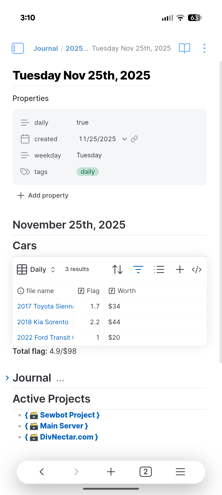
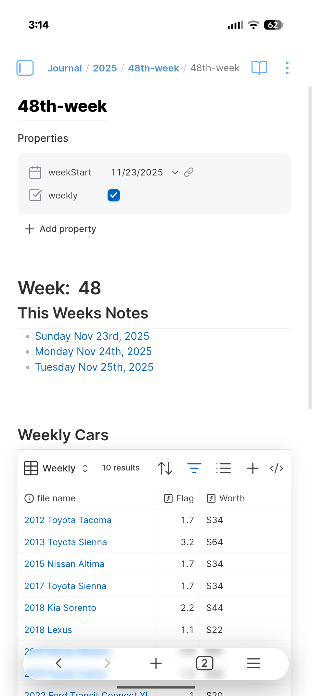

## Why Obsidian?

If you're anything like me, you often find it hard to keep track of all the things you're working on, or maybe just the things you **want** to work on. For me personally, my mind goes a million miles per hour most of the time. Thoughts and ideas have the habit of being fleeting - it took me some years but I have finally learned that if I don't write these fleeting ideas down then they just disappear 🫥.  This isn't ideal as sometimes the best thoughts are the fleeting ones - right before you sleep, during a shower, while eating, etc. Writing these ideas down as you have them keeps them from being lost.Then we're presented with a new issue; our note software is **full** of random unorganized ideas that are a pain to sift through. In some cases it can be nearly impossible to find the text that you're looking for. That's where **Obsidian** has changed my life. You can think of Obsidian as one of the most flexible pieces of software available for keeping personal knowledge. It can be as simple or as complex as you'd like to make it. It's essentially a markdown note editor with database-like features built into it. It is also extensible via plugins that are available in-app. Obsidian has become a nearly indispensable app in my life...without it my very limited free time would be spent thinking of what I want to do on any day. 

## My Workflow
I use Obsidian to keep track of my current and past projects, keep dev logs on projects, track my bills, track and organize my tasks, as a calendar, a journal, and so much more that I can't think of. It's kind of just my go-to app for everything now. 
When starting obsidian up I have a homepage that I designed to show me relevant information for a given day:

This "homepage" is responsible for tracking my work orders at work (that's a whole different write up lmao) as well as keeping track of any projects I'm currently working on. The projects at the bottom are actually links that when tapped/clicked will take you to the relevant note and tasks for that particular project. 
You'll notice at the top of the note is a card for **properties**. These can be thought of as note "data" while the text in the note is just the "content". The notes data/properties can be used to make queries in obsidian based on what properties a note does/doesn't have or even it's particular values at any given time. Take a look at my weekly note file: 

 So where you see this week's notes is actually a **query** for other notes that were created during the same week. Each of my daily notes for that week returns true for my query to show me a list of all daily notes for each week. This is the **true** power of Obsidian - not only can you just dump your brain into it, but with a little forethought you can also **organize** your brain with it. It truly is a second brain when used correctly.
Similarly to the "weeks notes" query, the "Weekly Cars" section queries for all work order notes I've made in a week, which are denoted by the "flag" property on the notes which is a number for how much that work order was worth. Using that property and some math I can aggregate everything I've worked on in a week and see what my paycheck will be (before taxes ofc).