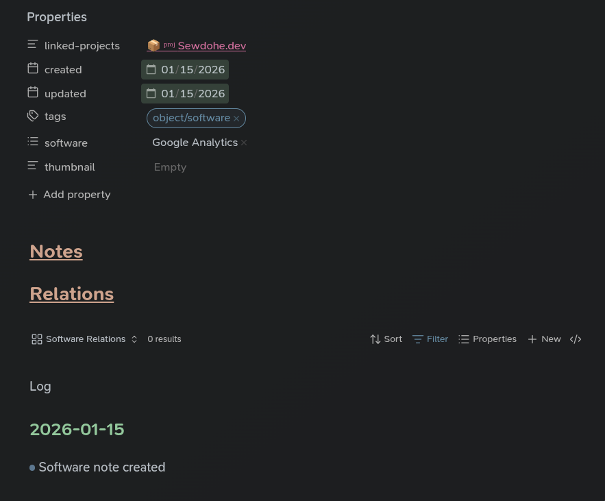
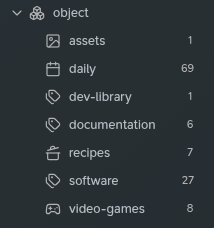
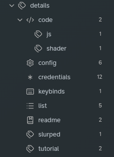
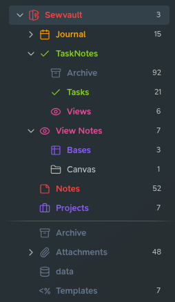
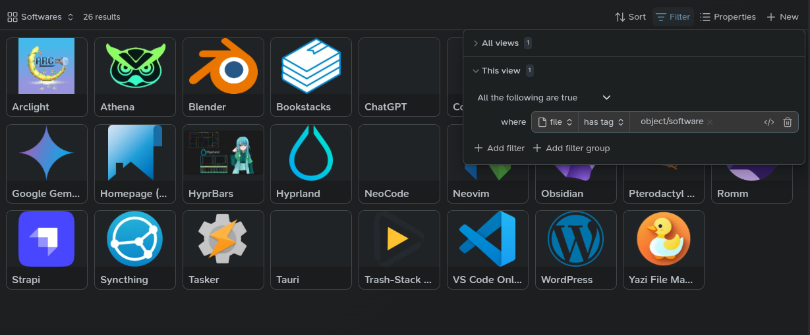
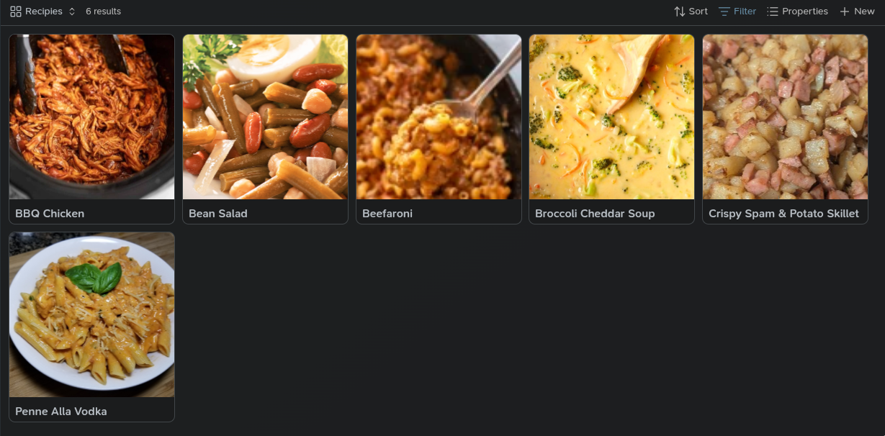
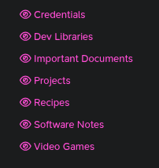

Obsidian is a powerful piece of software - it's capable of doing many, many things and it's capable of doing it in many, many different ways. I see on Reddit oftentimes that users have an *aha!* moment with Obsidian - and it seems to be different for different people. We all use it for different things so that comes as no surprise - but I'd like to explain how I got my *aha!* moment with Obsidian with the hopes that someone else can gleam their moment with this amazing piece of software.

## How I think about my Vault

I think of my vault as my task-keeper, time manager, and knowledge base. I use Obsidian to keep track of projects I want to work on, am working on, and have completed. I use it to track how much my bills are and when they are due. I use it to keep notes on various dev-libraries that I use in my computing shenanigans. So, keep this in mind when reading about how I use my Vault. Perhaps you want to keep track of important people in your life and your interactions with them - or maybe you want to start tracking how your thoughts and moods correlate to live events (I actually use it for that as well, matter of fact. It's a very healthy thing to do) but please keep in mind that this is just what works **for me.** It's won't necessarily apply to you in the same way. My best advice for you is to gleam what is relevant to you from this post and modify the system to suit your needs, but I plan to give you enough that after reading this post (and thank you very much for reading 🙏)  you'll be able to create your own system.

Let's get started!

## Organization Method

So, I like to look at my entire vault as an **inbox**. If you're familiar with [GTD](https://gettingthingsdone.com) (getting things done method) you should be familiar with the inbox. 

Essentially you treat your vault as a mind-dumping station. If you think of something of even minor importance - write that shit down! To me, it doesn't matter so much where the note goes. Over time you'll see categories arise from the chaos. But we'll deal with that later. At the moment of having a thought, memorialize it in a note. It's **such** a powerful thing to do. 

Example: Yesterday I was writing in my daily journal note about getting analytics working on my website again, literally just about how I was happy about it...but as I was writing, I realized the google analytics site was of importance to me...so I made a note about it. I made it as simply and as quickly as I could: by typing `[[Google Analytics]]` in Obsidian, it tried to make a link to that note. By right-clicking that link I was presented the option to turn that non-existing link into a note. Upon clicking the link to the note I had only a blank file - so the next step for me (considering it's a note about software) I applied my software-note template to it. That template looks like this:

I use the Templater plugin to be able to insert templates like this. If you're interested in a tutorial on that, please drop a comment at the bottom of this post 😀 

Let's look at this a little more closely though. Most softwares that I take notes on pertain to a project - in this case, my website project. I use backlinks to connect notes to projects, so just type `[[` in your frontmatter field and Obsidian will start auto-suggesting notes as you type the name of a note. This creates a literal link between this note and that project - they are **connected now.** 

Next are just date frontmatter fields - just to know how old the note is and when I last touched it. Don't really use it for much. The next field, the tags, **are very important.** Tags are (for me...) a way to categorize my notes, to tell Obsidian what that note is if you will. In this case - it's software. I have various tags nested under the `Object` tag: 

I hope seeing my object tags clarifies what they are used for - these are the **main things that my vault houses.** As my vault grows and I see I tag alot of things with a particular tag, I turn it into an object tag. Using the **tag wrangler plugin** allows easy renaming of tags - you can change a top-level tag into a sub-tag and all of your notes (and all usages of that tag) will be changed as well when you rename it. I **highly suggest using tag wrangler!** 

Tags can be used for anything that you'd like to categorize/group together though...as another example, I have a details tag as well, to denote details of a note:

As you can see, now I can categorize notes according to what they contain inside of them. Does the note contain configuration files? Login credentials of some sort? My insurance info? Does it teach something? Does it contain a list of things? These are all things that are worthwhile for me to know about my notes - which bring us to the next big thing about my vault: **view notes! 👁**

## Viewing Information Efficiently

So! Now we have a well-thought-out way to organize the vault. But our notes are a mess. Everything sits inside of one folder - all notes are right next to each other. And we do this so that creating a note has no overhead besides thinking about **what kind of note it is** and not **where the damn thing goes**. I was stuck thinking about my vault in terms of folders for a long time and it's not the right way to use Obsidian for me. Take a look at my file tree for my vault:

as you can see, I have just one folder where I dump notes. **Every other note in my vault are just relational notes, or task notes**. I do keep my journal notes in a separate folder - and I do plan to write about effectively journaling using Obsidian as well...it's a very healthy hobby I think. But I digress - we're here to talk about view notes and **bases** now 😆

Inside of that view notes folder I have one Obsidian base that's responsible for showing me views of anything I want to see - I mean, all of our notes are already tagged, right? Using bases we can conglomerate really any mixture of notes that we would like to see:

take a look at this beauty 😗 wow.

And look at how simple the filter for it is! Do you see the power we have created now? Just by dumping shit into a folder and **tagging it appropriately** we've turned those messy notes into a beautiful view of softwares that I keep notes on - and we can just create a new view in this base for each thing we want to see. Wanna see all software notes with credentials in them? Just filter that shit. Wanna see all your medical info from your dr visits? Just filter that shit. **FILTER THAT SHIT!**

I **I cannot over-exaggerate how powerful this is.**

Take a look at this beauty:

I've started taking notes when I cook great dinners so that I can remember them. I also notate the ingredients in the dishes so that I can look recipes up by what I have laying around the house. Once I saw that I would be creating lots of these notes, I did what I always do:

- create an object tag for it
- create a templater template for easy note creation
- create a view in my base to pull them up easily

It's really that simple to use Obsidian - it's just not **intutiive** to think this way. I think most people default to thinking of a file explorer and how we manage our files - but we have to think of our notes differently (again, in my case at least. Yours may be different).

To put the icing on the cake, I also make singular view notes for views that I pull up often. Check it:

These are my view notes. They are literally **just files which refer to the different views in my views base.** All you do is create a new note and link your base and specify which view you want it to show using the `![[base-name#view-name]]` syntax and Obsidian will show that view of that base inside of your note. I do this so that I can quickly jump to that list of notes using the quick-switcher (using the `crtl + O` keyboard shortcut or swiping down on android/IOS). It's just another method of convenience. A way to get from A to B with less friction - **the less you think about note taking, the more notes you will create.**

Find what is important in your life and categorize it. Make a template for it. Define tags for the things, and just **write that shit down.** The rest will come over time if you use my method.

## Thank you for reading 🙏

I truly appreciate anyone taking the time to read my ramblings. I am new to writing and I know I'm not the best at it. I am welcome to any constructive criticism, in fact I am asking you for it. I would like to write more on my site and getting feedback is the best way for me to get better I think. I welcome you to leave a comment down below - I would enjoy the engagement, truly. Commenting does require a Github account unfortunately. I may switch up the comment system in the near future - depends how motivated I feel 😛
